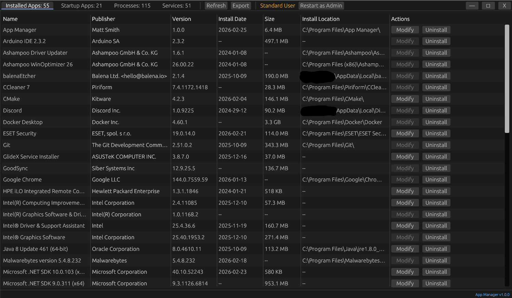

# App Manager

A Windows GUI tool for inspecting and managing installed applications, startup applications, processes, and services. Built with Rust and egui.

Pre-compiled downloads and installers are available on the project's [GitHub Releases](https://github.com/mattx86/app-manager/releases) page.



## App Sections

### Installed Apps

Lists all installed applications from the Windows Uninstall registry.

- Scans `HKLM` and `HKCU` Uninstall keys, including `WOW6432Node` for 32-bit apps
- Displays name, publisher, version, install date, size, and install location
- Deduplicates entries across registry hives
- **Actions** — Modify and Uninstall with confirmation dialog

### Startup Apps

Lists all startup entries from the registry, startup folders, Task Scheduler, and services.

- **Registry Run keys** — Scans `HKCU` and `HKLM` under `CurrentVersion\Run`, `RunOnce`, and `Wow6432Node` variants
- **Startup folders** — Scans per-user and common Startup directories, resolving `.lnk` shortcut targets
- **Task Scheduler** — Queries scheduled tasks with logon triggers via COM, filtering out service-only tasks
- **Enabled/Disabled detection** — Reads `StartupApproved` registry keys (same source as Task Manager)
- **Running/Stopped detection** — Matches executables against currently running processes
- **Last Ran timestamps** — Uses process start time (if running), Prefetch metadata (if admin), or disabled timestamps
- **Actions** — Enable, Disable, Start, Stop, Delete, and Properties

### Processes

Lists all running processes in a collapsible parent-child tree view.

- Displays PID, name, product name, command line, CPU %, memory, disk read, disk write, runs as, and start time
- **Hide Windows Processes** checkbox filters out known Windows system processes
- **Auto-Refresh** checkbox refreshes the process list every 3 seconds
- Tree view with expand/collapse for parent-child process relationships
- Shows elevation indicator for processes running as administrator
- **Actions** — Kill processes and view process properties

### Services

Lists all Win32 services with their product name, command line, start type, run state, account, and last started time.

- **Hide Windows Services** checkbox filters out known Windows system services
- **Actions** — Enable (auto-start), Disable, Start, Stop, and Properties

## Features

- Restart as Administrator button for elevated access
- Resizable tables with row selection and hover highlighting
- CSV export for any tab
- Properties dialogs for startup entries, services, and processes

## Data Sources

| Source | Location | Admin Required |
|---|---|---|
| Installed Apps | `HKLM` and `HKCU` `...\CurrentVersion\Uninstall` | No |
| Registry Run | `HKCU\Software\Microsoft\Windows\CurrentVersion\Run` | No |
| Registry Run | `HKLM\Software\Microsoft\Windows\CurrentVersion\Run` | No |
| Registry RunOnce | `HKCU\...\RunOnce`, `HKLM\...\RunOnce` | No |
| Registry Run (32-bit) | `HKLM\Software\Wow6432Node\...\Run` | No |
| User Startup Folder | `%APPDATA%\...\Startup` | No |
| Common Startup Folder | `%ProgramData%\...\Startup` | No |
| Task Scheduler | Logon-triggered tasks (COM API) | Partial |
| Processes | `sysinfo` crate + Windows token APIs | No |
| Services | Windows API (`EnumServicesStatusExW`) + registry `HKLM\SYSTEM\CurrentControlSet\Services` | No |
| Prefetch (Last Ran) | `C:\Windows\Prefetch\*.pf` | Yes |

## Building

Requires Rust and a Windows target.

```powershell
# Build everything (EXE + ZIP + MSI)
.\build.ps1 all

# Or build individual targets
.\build.ps1 exe       # Release EXE only
.\build.ps1 zip       # EXE + ZIP archive
.\build.ps1 msi       # EXE + MSI installer
.\build.ps1 clean     # Remove dist\ directory
```

Artifacts are placed in the `dist\` directory:

| Target | Output |
|--------|--------|
| EXE | `app-manager.exe` |
| ZIP | `app-manager-X.Y.Z-x86_64.zip` |
| MSI | `app-manager-X.Y.Z-x86_64.msi` |

### MSI Installer

Building the MSI requires the WiX 3 toolset in `tools\wix3\`. Download from
[WiX 3 releases](https://github.com/wixtoolset/wix3/releases) and extract to `tools\wix3\`.

## License

[MIT](LICENSE.md) — Copyright (C) 2026 Matt Smith
